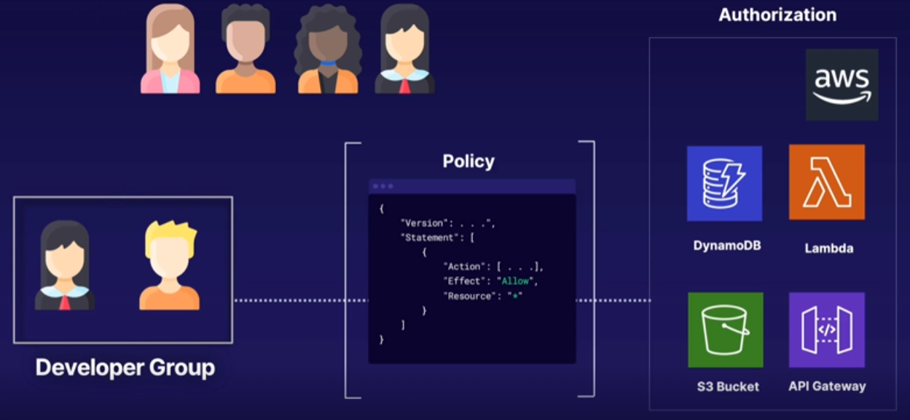
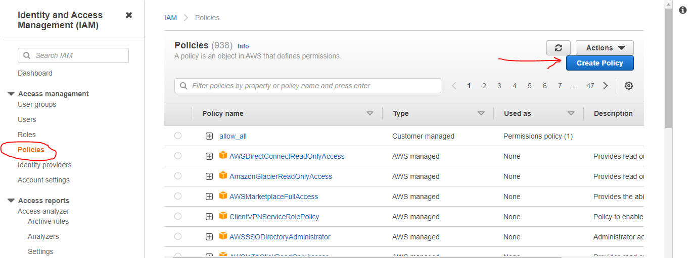
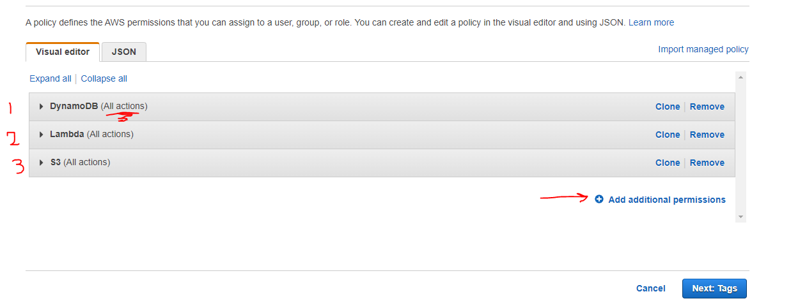
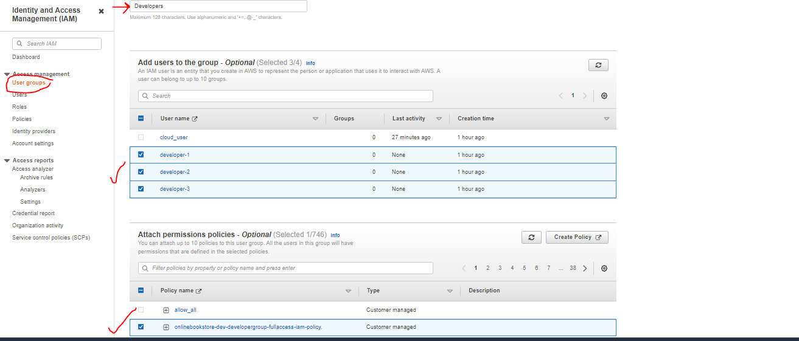
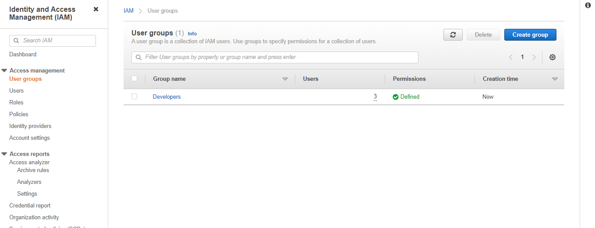

# Managing AWS IAM User Permissions Using Groups and Policies

## Introduction

In this hands-on lab scenario, you are a security engineer working for a new startup that's launching an online bookstore for rare and antique books. The founder, Kia, needs your help with **setting up her development team with the proper access permissions**.

In order to provide access and ensure the proper security measures are in place, you will use AWS Identity & Access Management (IAM). You will group users and assign permissions for the developer group using policies.

---

## Solution

- Make sure you're in the N. Virginia (us-east-1) region throughout the lab.

- Create a Customer-Managed Policy

  - create policy 
  - Fill in the policy permissions for `DynamoDB`+`lamda`+`s3` with `all access /resources checked` 

  - add Review policy
    - In the Name field, enter `onlinebookstore-dev-developergroup-fullaccess-iam-policy`

- Create a Group Controlled via a Customer-Managed Policy and Assign Users to a Group
  - In the User group name field, enter `Developers`
  - In the `Add users to the group - Optional` section, select the following user names to assign the developers to this group:
    - developer-1
    - developer-2
    - developer-3
  - In the `Attach permissions policies- Optional` section, select the policy you just created: `onlinebookstore-dev-developergroup-fullaccess-iam-policy`
  
   

- Success
  
   