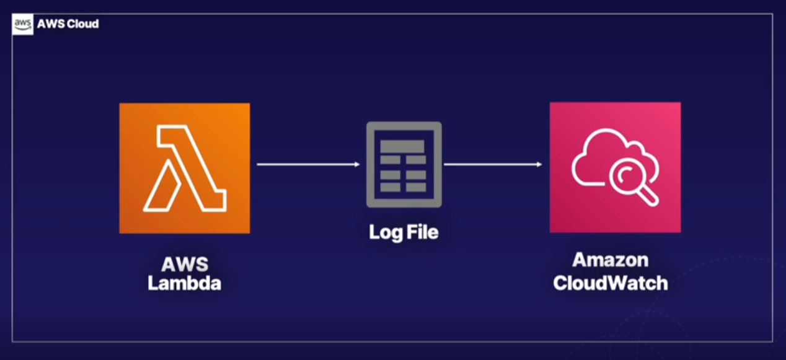
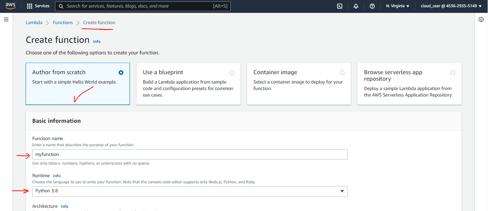
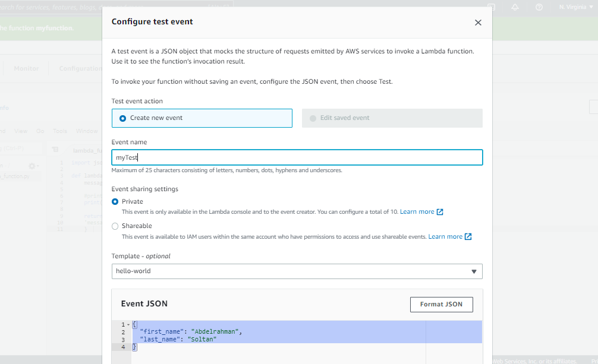
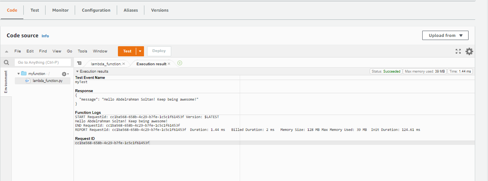
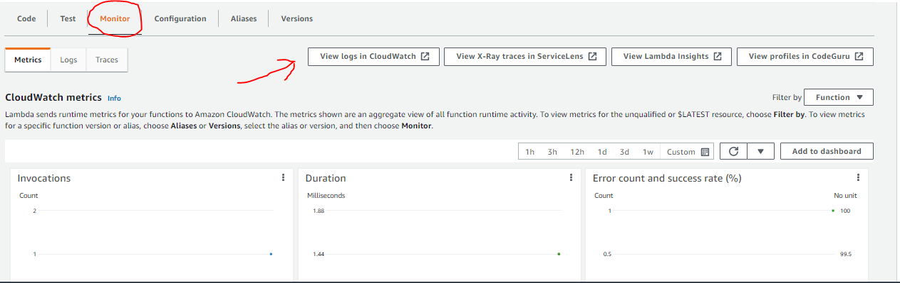
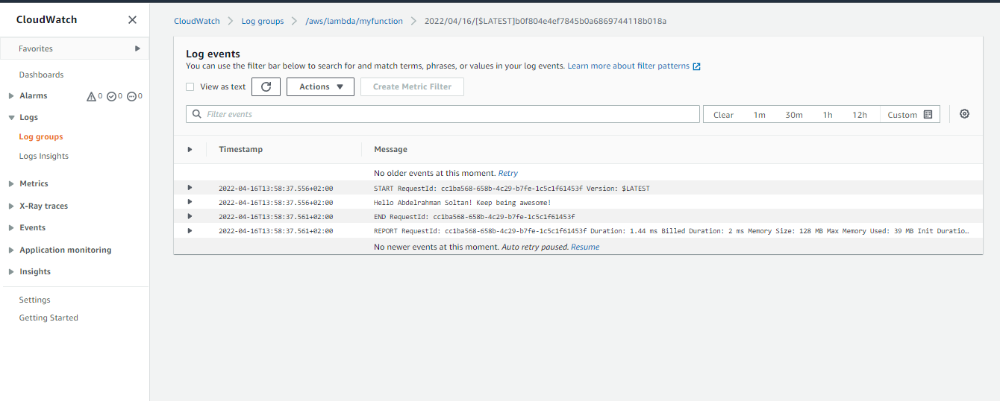

# Creating a Lambda Function with the AWS Management Console

## Introduction

In this lab scenario, **Alfredo's Pizza** is a global fast-food chain selling delicious pizza. Their website serves thousands of customers each day and processes over 6 million in payments each week. While Alfredo is doing well, he's not seeing the customers he had hoped for, and relying on expensive always-on servers ends up with resources sitting idle, wasting money.

Alfredo wants to migrate his application to a serverless architecture with the hope of saving on operating costs. We'll help him by showing him how easy Lambda functions can be.

In this hands-on lab, you'll **author a Lambda function using the Python programming language in the AWS console. We will also review logs generated by CloudWatch.**



---

## Solution

- Make sure you're in the N. Virginia (us-east-1) region throughout the lab.

- Author Lambda Function in Python

  - Create function with (Author from scratch) 
  - Create a new role with `basic Lambda permissions`
  - use this code in `lambda_function.py` then **Deploy** :

    ```py
    import json

    def lambda_handler(event, context):
        message = 'Hello {} {}! Keep being awesome!'.format(event['first_name'], event['last_name'])

        #print to CloudWatch logs
        print(message)

        return {
        'message' : message
        }
    ```

- Create a Test Event and Execute Lambda

  - Open the Test menu and click `Configure test event` and insert this code :

    ```json
    {
      "first_name": "Abdelrahman",
      "last_name": "Soltan"
    }
    ```

    

  - test the code 
    

- Verify that CloudWatch has Captured Function Logs
  - Click the Monitor tab + Click `View logs in CloudWatch`  
  

- Success

  
