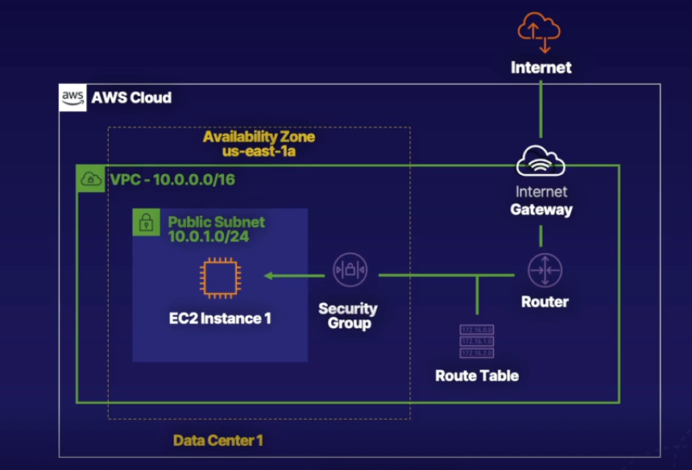
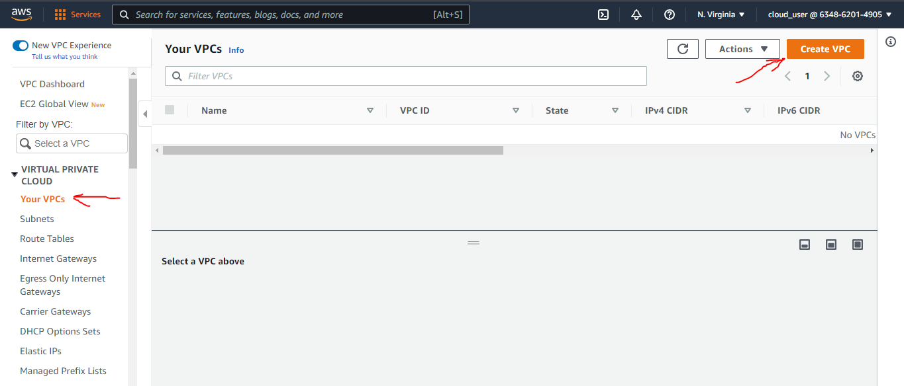
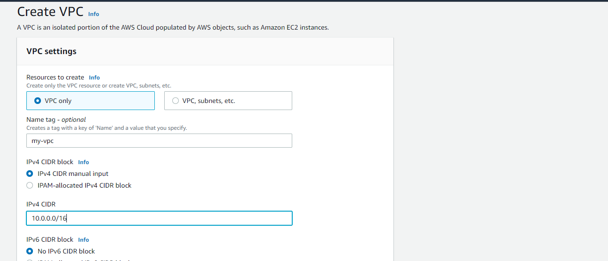
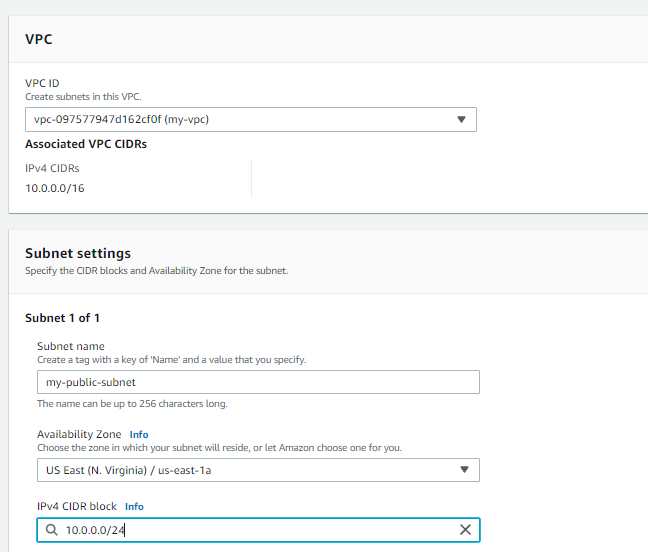
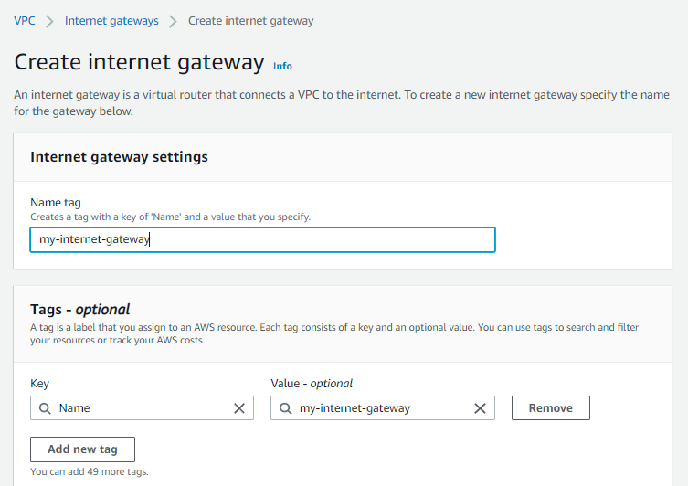
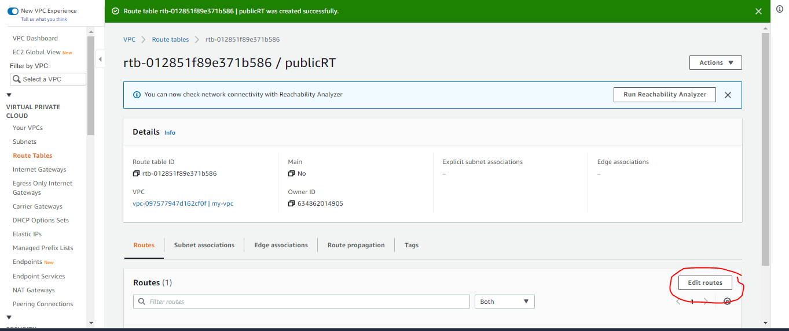
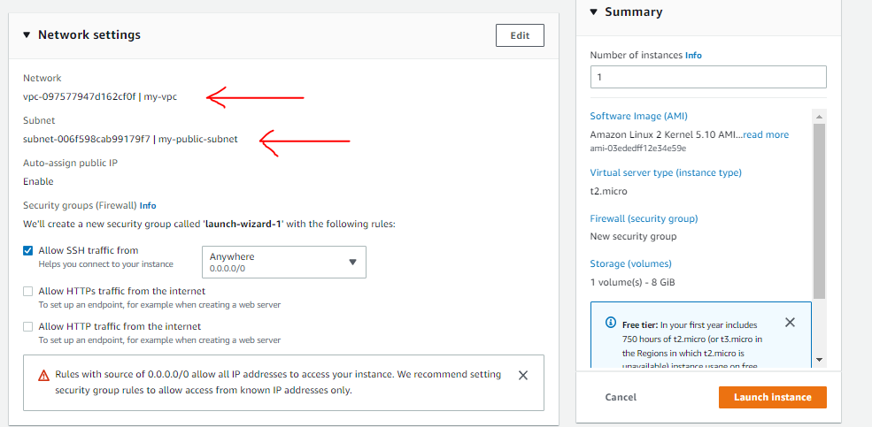
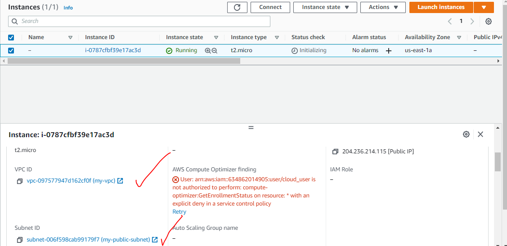

# Launch an EC2 Instance in a Virtual Private Cloud (VPC)

## Introduction

In this lab scenario, Alfredo of Alfredo's Pizza is looking to set up a website to advertise his pizza shop. We are going to help him by getting the server primed and ready to host his website. During this lab, you'll have the opportunity to explore and understand foundational and compute services provided by AWS. We will **create a virtual private cloud (VPC), subnets across multiple Availability Zones (AZs), routes and an internet gateway**, and more. These services are the foundation of networking architecture inside of AWS and cover concepts such as infrastructure, design, routing, and security.

---

## Solution

- Make sure you're in the N. Virginia (us-east-1) region throughout the lab.

- Create a `VPC`

  - Create VPC, and set the following values:
    - Name tag: `my-vpc`
    - IPv4 CIDR block: `10.0.0.0/16`

  
  

- Create a `Public Subnet`

  - subnets --> `Create subnet`, set the following values:

    - VPC ID: my-vpc
    - Subnet name: my-public-subnet
    - Availability Zone: us-east-1a
    - IPv4 CIDR block: 10.0.0.0/24

    

- Create `Routes` and Configure `Internet Gateway`

  - To make the subnet public :

    - Select `my-public-subnet` -> click `Actions` -> `Edit subnet settings`
    - Check the box to Enable auto-assign public IPv4 address.

  - Create `Internet Gateway`

    - Click Internet Gateways in the left-hand menu.
    - Click Create internet gateway.
    - Set Name tag as "my-internet-gateway".

    

  - Attach the `internet gateway` to the `VPC`

    - click `Actions` > Attach to VPC.
    - In the Available VPCs dropdown, select `my-vpc`.

  - Create route table

    - Click `Route Tables` in the left-hand menu.
    - Create route table, and set the following values:
      - Name: publicRT
      - VPC: my-vpc

  - Add route
    
  - Add route, and set the following values:
    - Destination: 0.0.0.0/0
    - Target: `Internet Gateway` --> `my-internet-gateway`
    - Click the `Subnet associations` tab.
    - Edit -> Select the box for `my-public-subnet`.
      

- Launch `EC2` Instance in Subnet

  

- Success

  
