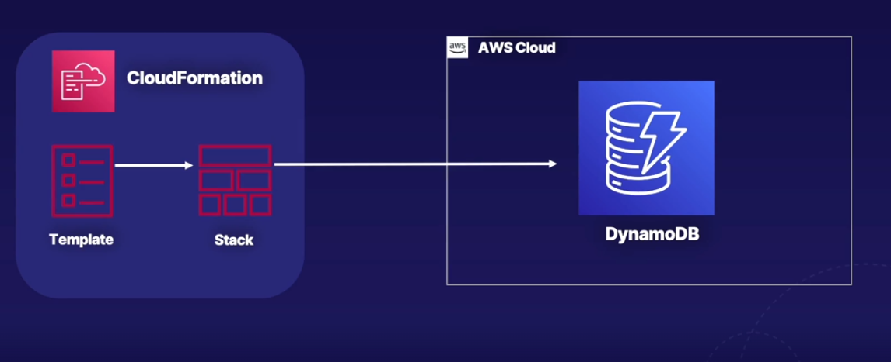
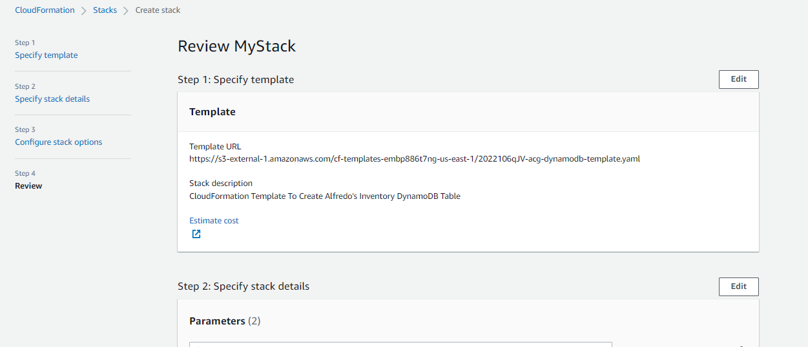
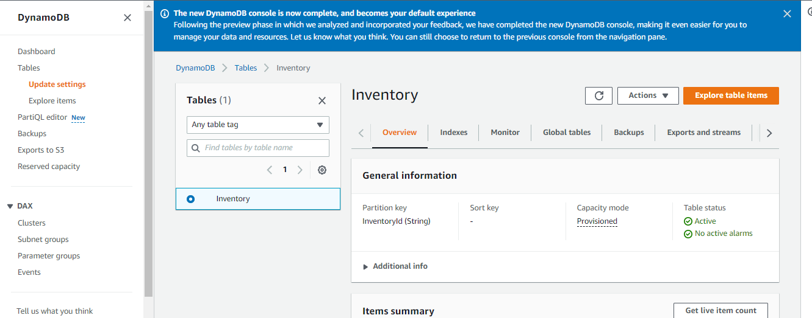

# Create a DynamoDB Table Using CloudFormation

## Introduction

In this lab scenario, Alfredo of Alfredo's Pizza is building a web application to manage his supply and food inventory. That's where you and I come in. He's looking for our help to provision his database infrastructure, which will hold his data. **We'll use CloudFormation to write the desired state of the infrastructure using code, which includes a DynamoDB table to hold inventory items**. We'll first launch the resources in his development environment, but the template can later be used to launch a stack in the test and production environments as well. By the end of this lab, you'll have a good understanding of infrastructure as code using CloudFormation.

---

## Solution

- Make sure you're in the N. Virginia (us-east-1) region throughout the lab.

- Launch CloudFormation Stack

  - `CloudFormation` -> `Create stack` button in the top right corner.
  - Select `With new resources (standard)`
  - select `Template is ready`.
  - Upload the `yaml`-template file
  - stack name : `MyStack`

  

- Verify DynamoDB Table Created

  - `DynamoDB` -> navigation menu on the left-hand side, click `Tables` -> `Inventory` table

- Success

  
